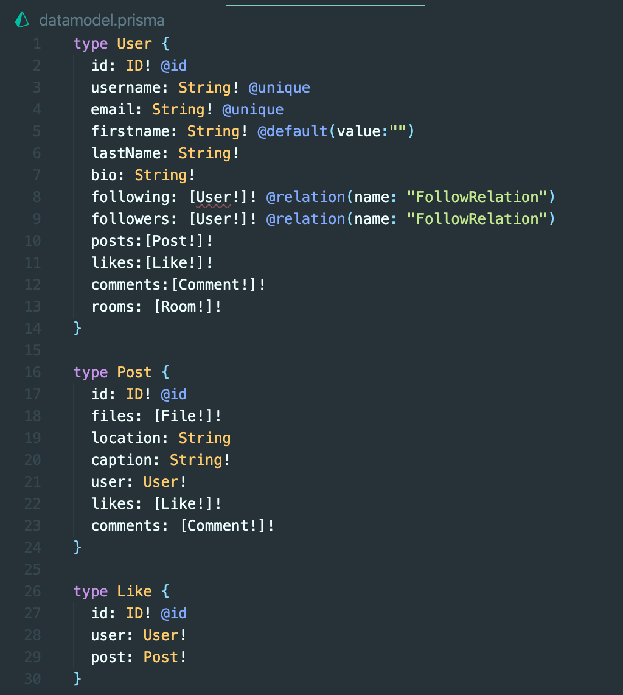
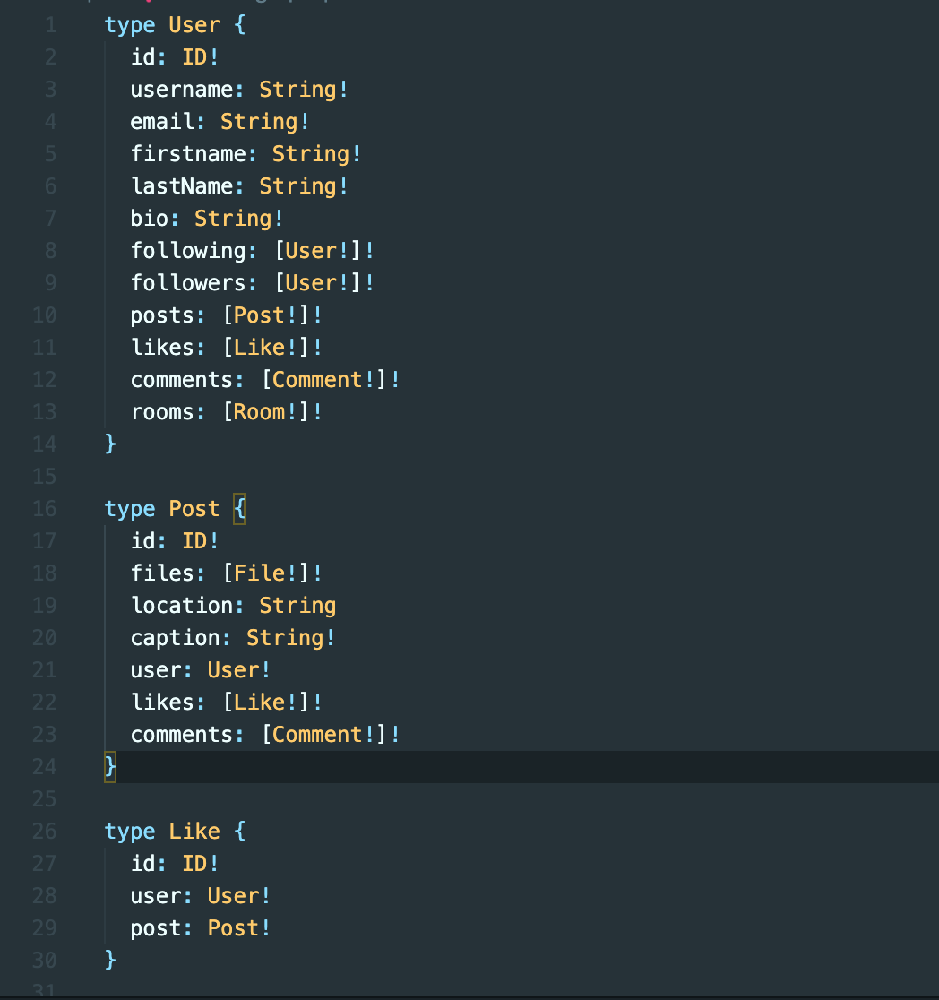

## 1. graphql 파일 생성하기

prisma와 graphql의 연결을 위해서는 graphql 파일이 필요합니다.

api 폴더에 models.graphql 파일을 만들어줍니다.

datamodel.prisma에 있던 내용을 모두 복사해서 models.graphql 파일에 넣습니다.



이때 graphql에서는 @를 인식하지 못하기 때문에 꼭 @id, @unique, @relation을 삭제해 주셔야 합니다.



## 2. \$fragment

prisma는 무한 query 공격을 막기 위해서 \$fragment를 사용합니다.  
아래 예시를 봅시다.

```graphql
userById("sdasasd") {
    username
    following{
        id
    }
}
```

얼핏 보면 문제가 없는 것 같지만

```graphql
userById("sdasasd") {
    username
    following{
        id{
            following{
                id{
                    following{
                        id
                    }
                }
            }
        }
    }
}

```

이런 식으로 코드를 짜면 무한 query 공격이 올 수 있기 때문에 \$fragment를 사용하는 것입니다.

\$fragment에 대해서는 따로 정리하도록 하겠습니다.
