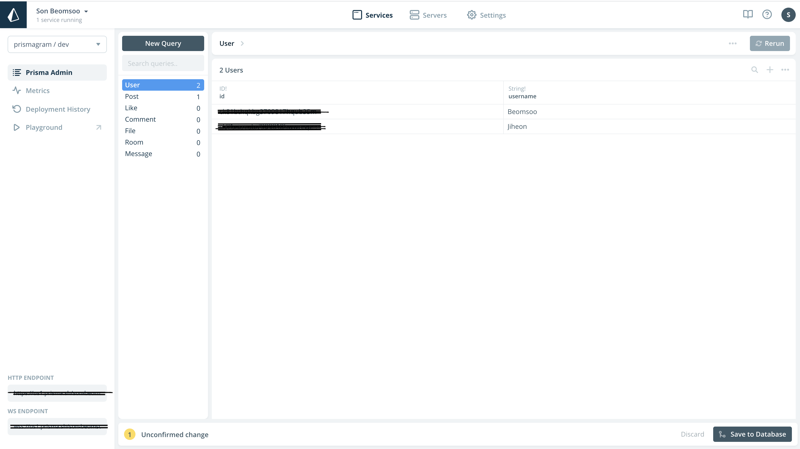
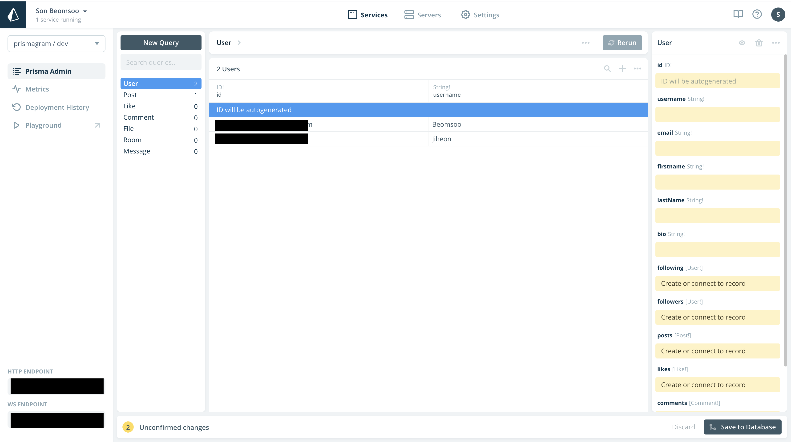
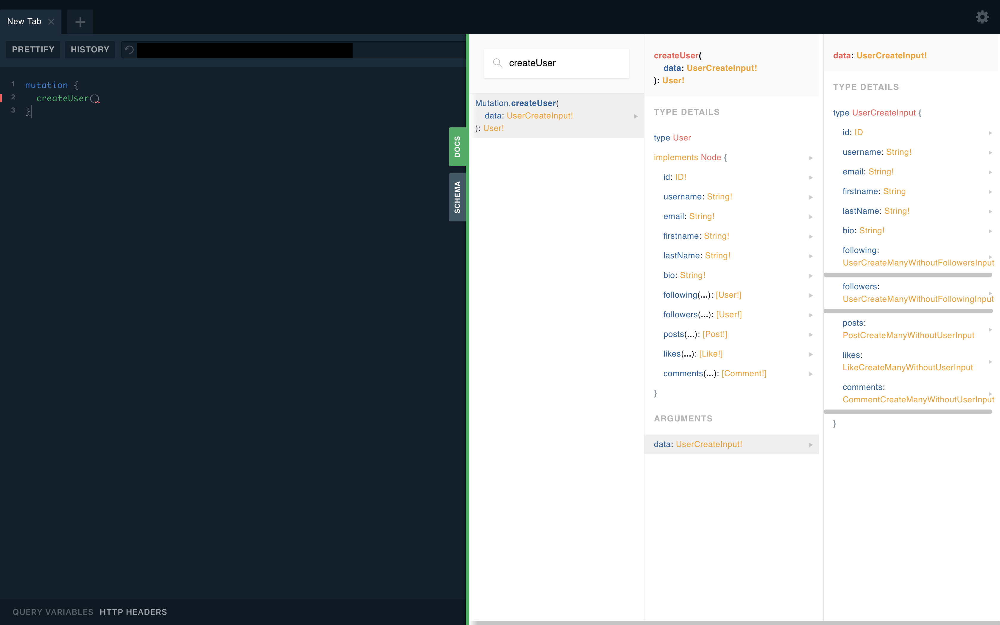
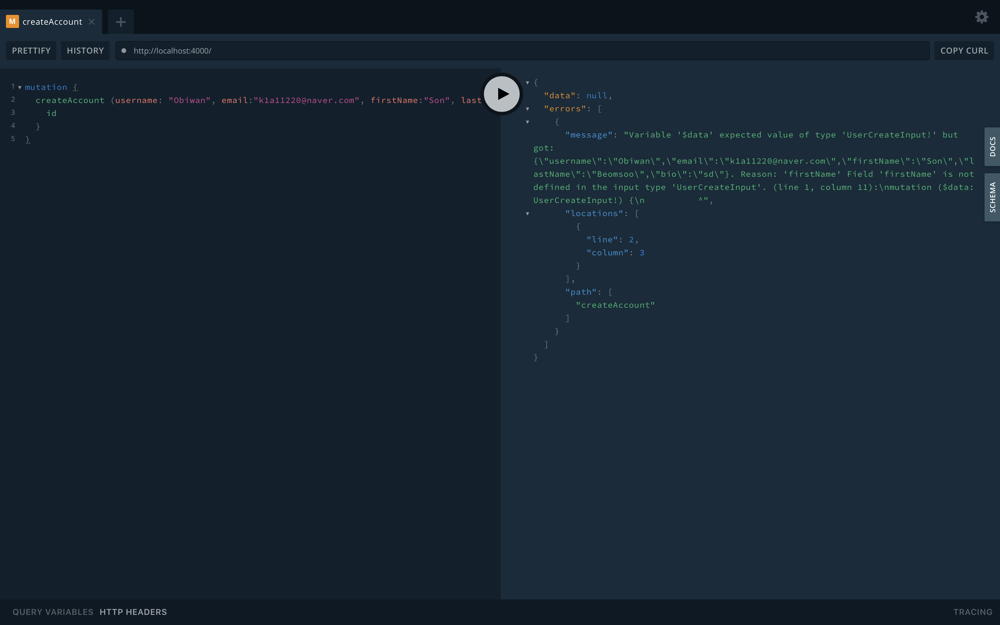
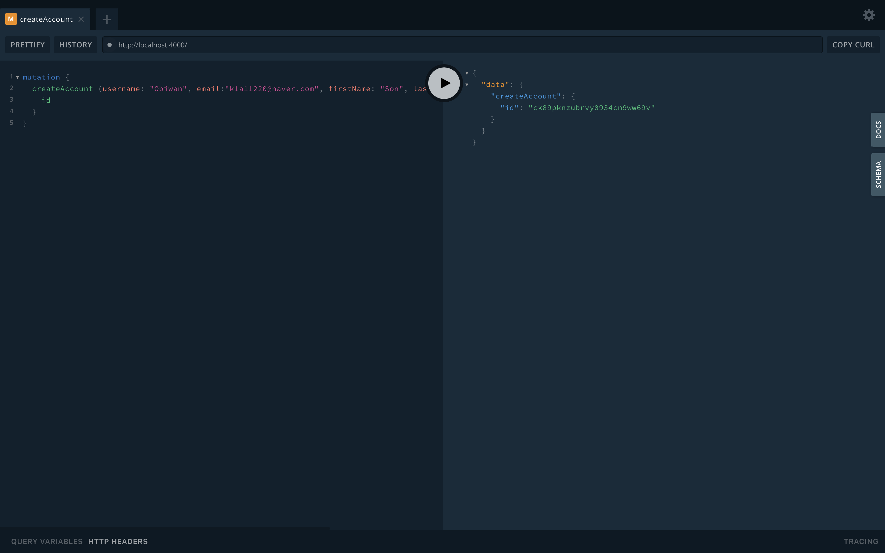

**await, async, \_, args 등 JavaScript내용은 따로 정리하겠습니다.**

## 0. 테스트용 계정 만들기

사진 업로드, 좋아요, 댓글 달기 등 여려 기능을 테스트할 계정을 prisma 어드민에서 만듭니다.



어드민창에서 + 버튼을 눌러 계정을 하나 생성합니다.



api/Image 폴더를 만듭니다.

Image/toogleLike라는 폴더를 만들어 이미 좋아요가 되어있으면 취소로 아이콘이 바뀌게끔 하겠습니다.

먼저 createAccount 시스템을 만들어야 하니 다음으로 넘어갑니다.

## 1. createAccount 시스템 만들기

본격적으로 백엔드의 기능들을 구현해봅시다.

- User 폴더를 만들고 그 안에 createAccount 폴더를 만듭니다.

```
api/User/createAccount/.graphql & .js
```

- createAccount.graphql 파일에는 계정을 만들 수 있는 mutation type을 작성합니다.

```graphql
type Mutation {
  createAccount(
    username: String!
    email: String!
    firstName: String
    lastName: String
    bio: String
  ): User!
}

type Query {
  something: String!
}
```

사용자 생성을 위한 정보들입니다. 이때, 필요한 정보들은 endpoint에서 docs -> createUser를 검색하면 찾을 수 있습니다.



- 이어서 createAccount.js 파일을 만들고 async 함수로 createAccount 함수를 만듭니다. 이때 첫 번째 인자는 필요 없고 args는 필요합니다.

```js
import { prisma } from "../../../../generated/prisma-client";

export default {
  Mutation: {
    createAccount: async (_, args) => {
      const { username, email, firstName = "", lastName = "", bio = "" } = args;
      const user = await prisma.createUser({
        username,
        email,
        firstName,
        lastName,
        bio,
      });
      return user;
    },
  },
};
```

firstName, lastName, bio는 - ""로 되어있는데, 그 이유는 필수로 입력되는 항목이 아니기 때문에 빈 문자열을 기본으로 선언하여 null과 같은 이상한 타입이 들어오지 않도록 하는 것입니다.

## 2. Account 만들어보기

createAccount를 만들었으면 yarn dev를 해서 생성된 localhost에 접속하여 mutation createAccount를 실행시켜볼 수 있습니다.



에러가 나옵니다.



해결했습니다!

## 이슈

- datamodel에서는 firstname createAccount에서는 firstName이라서 에러가 발생했었습니다. 따라서 datamodel을 수정한 뒤

```
yarn prisma deploy --force
```

로 업데이트 해야합니다.

- 모든 resolvers가 지워지면 자동으로 prisma가 import 되지 않습니다.  
  따라서 첫 번째 resolvers는 직접 prisma를 import 시켜줘야 합니다.

```js
import { prisma } from "../../../../generated/prisma-client";
```

- graphql 파일에 query가 없는 경우 에러가 생기기 때문에 꼭! type Query를 추가해야 합니다.

```graphql
type Mutation {
  createAccount(
    username: String!
    email: String!
    firstName: String
    lastName: String
    bio: String
  ): User!
}

type Query {
  something: String!
}
```
