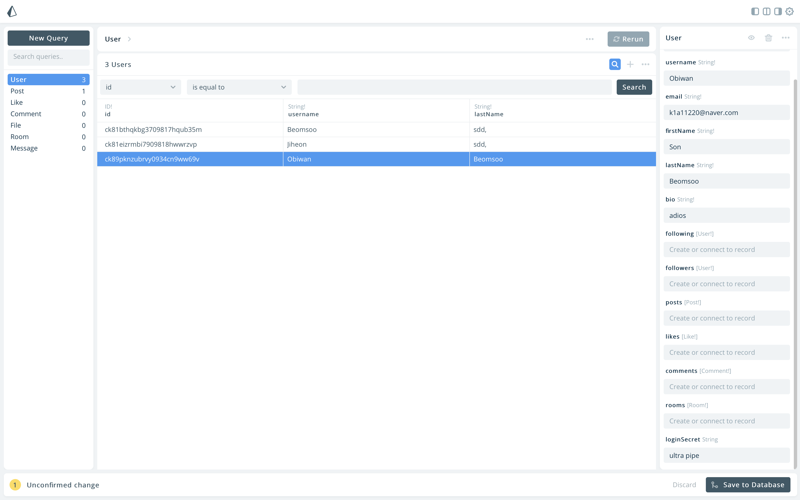

## 1. 비밀값 요청기능

사용자를 만들었으면, 비밀 값을 요청하고 확인하는 기능을 구현합니다.

주로 사용하는 비밀 값은 형용사+명사를 조합해서 만듭니다. ex) violent tank

User 폴더에 requestSecret 폴더를 만듭니다.

graphql 파일에 requestSecret Mutation을 추가합니다. 이때 Boolean 타입을 반환합니다.

```graphql
type Mutation {
	requestSecret(): Boolean!
}
```

함수의 인자로는 Sting 타입의 이메일이 필요합니다.

```graphql
type Mutation {
  requestSecret(email: String!): Boolean!
}
```

js 파일에는 async 함수로 requestSecret 함수를 만듭니다.  
첫 번째 인자는 필요 없고, 두 번째 인자는 args라고 하겠습니다.  
args에서 email을 가져옵니다.

```js
export default {
  Mutation: {
    requestSecret: async (_, args) => {
      const { email } = args;
    },
  },
};
```

api 폴더 바깥에 비밀 값을 생성할 함수를 만듭니다.

src/utils.js 만든 다음 단어들을 저장할 words.js를 생성합니다.

```js
export const adjectives = [];
export const nouns = [];
```

utils.js에는 값을 생성할 함수를 만들어주고 단어를 import 합니다.

```js
import { adjectives, nouns } from "./words"

export const genertateSecret = () => {
    const randomNumber =
}
```

이때 무작위로 단어를 생성하는 함수를 테스트해보겠습니다. 크롬 콘솔에서 단어들을 생성하고 Math.random 함수를 실행합니다. Math.random은 0에서 1사이의 무작위 수를 생성합니다.  
그럼 0과 adjectives의 길이 사이의 임의의 수를 만들어줍니다.

```js
Math.random() * adjectives.length;
```

이때 소수점을 반내림하는 Math.floor를 추가하여 정수를 만들겠습니다.

```js
Math.floor(Math.random() * adjectives.length);
```

위에서 만든 math 함수를 utils에 추가하고 랜덤한 숫자를 반환받도록 하겠습니다.

```js
import { adjectives, nouns } from "./words";

export const generateSecret = () => {
  const randomNumber = Math.floor(Math.random() * adjectives.length);
  return `${adjectives[randomNumber]} ${nouns[randomNumber]}`;
};
```

## 2. 함수 검증하기

지금까지 만든 함수를 활용하여 지정된 이메일로 비밀 값을 받아보겠습니다.

```js
import { generateSecret } from "../../../utils";
import { prisma } from "../../../../generated/prisma-client";

export default {
  Mutation: {
    requestSecret: async (_, args) => {
      const { email } = args;
      const loginSecret = generateSecret();
      console.log(loginSecret);
      try {
        await prisma.updateUser({ data: { loginSecret }, where: { email } });
        return true;
      } catch {
        return false;
      }
    },
  },
};
```

이렇게 하고 localhost에서 mutation을 실행시키면,

```js
mutation {
  requestSecret(email:"k1a11220@naver.com")
}
```

false 에러가 나오는데 이건 datamodel에서 loginSecret을 !(필수)로 했기 때문입니다.

prisma와 graphql 모두 바꿔줍니다.

```graphql
type User {
  loginSecret: String!
}

type User {
  loginSecret: String
}
```

그다음 mutation을 실행시키면 ture 값이 반환되고 어드민 페이지에 들어가서 살펴보면



loginSecret 값이 들어와있습니다.
