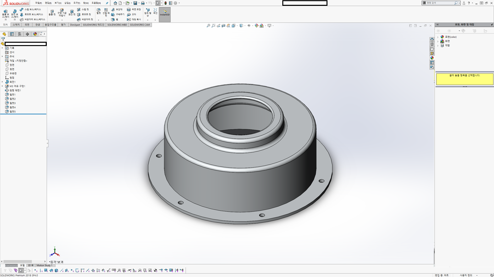
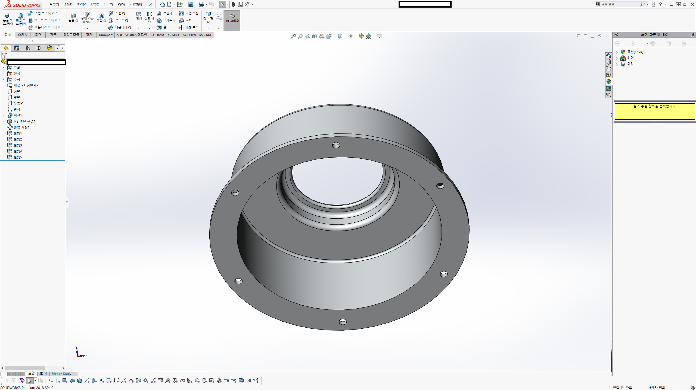
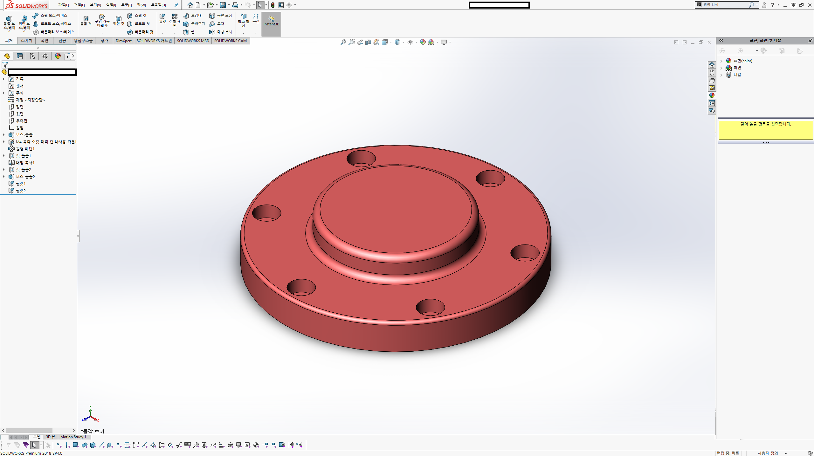
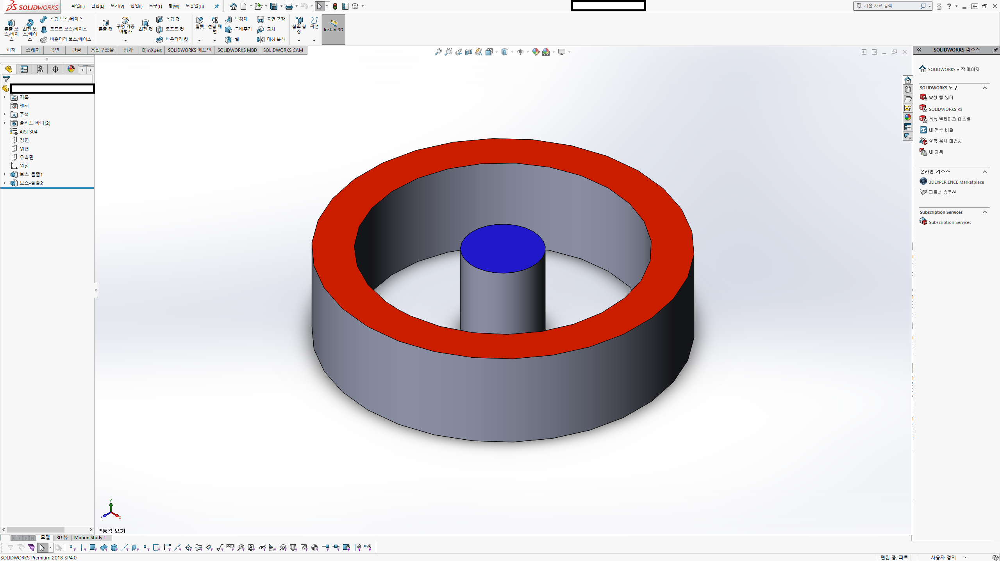

_본 포스트에서 다루는 내용은 모두 컨샙설계입니다. 실무에서 사용시 생기는 문제에 대하여 책임지지 않습니다._

## 1. 스퍼터링이란?

스퍼터링은 디스플레이, 집적회로등 여러 분야에서 사용되는 방식 중 하나로서 쉽게 말해 얇은 박막을 입히는 증착법의 일종이라고 생각하시면 됩니다.

> 스퍼터링 (Sputtering) :스퍼터링(Sputtering)은 집적회로 생산라인 공정에서 많이 쓰이는 진공 증착법의 일종으로 비교적 낮은 진공도에서 플라즈마를 이온화된 아르곤 등의 가스를 가속하여 타겟에 충돌시키고, 원자를 분출시켜 웨이퍼나 유리 같은 기판상에 막을 만드는 방법을 뜻한다. 스퍼터링 장비에서는 타겟쪽을 음극(Cathode)로 하고 기판쪽을 양극(Anode)로 한다. 스퍼터링 공정을 진행하는 장비를 스퍼터 혹은 스퍼터링 시스템이라 한다.

스퍼터건은 이러한 스퍼터링 공정을 수행하기 위해 제작된 건 (Gun)입니다. 마치 총처럼 타켓을 기판이나 글라스에 증착시킵니다.

## 2. 스퍼터건의 구조

크게 6가지 정도로 스퍼터건의 구조를 나누어 설명하겠습니다.

1. Shield
2. Target
3. Cu Plate
4. Magnet
5. Insulator
6. Power

하나씩 모델링 해보며 구조를 분석하겠습니다.

## 3. Shield

쉴드 (Shield)는 말 그대로 Cu Plate와 Target를 보호해 주는 역할을 합니다.

2~5mm 정도의 여유를 두고 디자인하시면 됩니다.

## 4. Target & Cu Plate

Target은 증착 시킬 재료를 말합니다. Ti, Co 등 다양한 재료로 만들어집니다. Cu Plate 위에 본딩 되어 고정하므로 Plate와 함께 모델링 해도 상관없습니다.

## 5. Magnet

자력선이 N -> S 극으로 이동하는 원리를 이용하는 것이기 때문에 N를 바깥에 S을 안쪽에 위치시킵니다.

