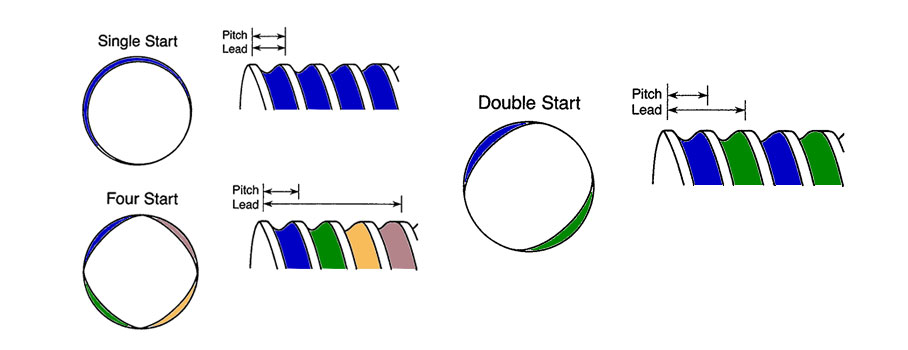

## 용어, 단위 정리

### 리드

**스크류 홈 사이의 거리**이며, 인치 크기의 제품에서 일반적으로 사용되고, 인치당 나사산으로 규정됩니다.

### 피치

**너트가 스크류 1회전당 이동하는 직선 거리**이며, 볼 스크류의 일반적인 규격입니다. 피치와 리드는 한 줄 나사(single start screw)와 같습니다. 여러 줄 나사(multiple start screw)에서 리드는 피치를 개시점의 수로 나눈 것입니다.

### 토크(Torque)란

**단위 : kgf.m**

비틀림 모멘트라고도 합니다. 쉽게 말해서 '**물체를 회전시키는 힘**' 이라 생각하시면 됩니다.

### 1kgf.m가 어느 정도의 힘인가?

1m 길이의 막대기 끝에 1kg의 힘을 가했을 때 축에 전달되는 힘이 1kgf.m입니다.

---

## 수평, 수직이동에서 필수 요소인 볼스크류

수평, 수직이동은 장비 설계에서 빠지지 않는 움직임입니다. 이때 가장 많이 사용되는 파트가 볼스크류와 LM인데요, 오늘은 그중에서 볼스크류의 수평토크를 계산해보도록 하겠습니다.

### 추력을 얻기 위한 구동토크

$$T ={Fa \cdot Ph\over 2\pi \cdot  \eta 1}$$

**T : 구동토크**

**Fa : 안내면의 마찰저항**

**Fa = u \* mg**

**u** : 안내면의 마찰계수
**g** : 중력가속도
**m** : 반송물의 질량

**Ph : 이송 나사 리드**

**n1 : 이송 나사의 정효율**

### 예제

질량 500kg 물체를 유효경 : 33mm, 리드 : 10mm (리드각 : 5°30')의 나사로 움직일 때 필요한 토크는?

볼나사(Ball Screw)를 사용했기 때문에 매우 높은 효율을 얻을 수 있습니다. 따라서 위의 예제를 풀어보면.

T = 14.7 _ 10 / 2𝝅 _ 0.96 = 24N·mm

24N·mm의 토크가 필요한 것을 알 수 있습니다.

Reference : [THK카달로그](https://www.thk.com/sites/default/files/documents/kr_pdf/500-5k/Ball%20Screw/500-5K1_A15_BallScrew_1_13.pdf)
