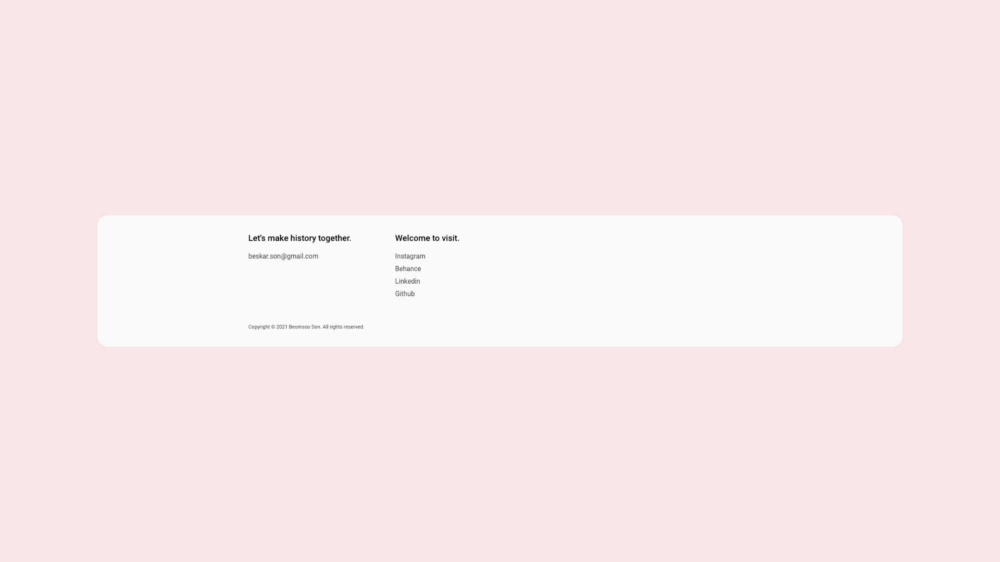
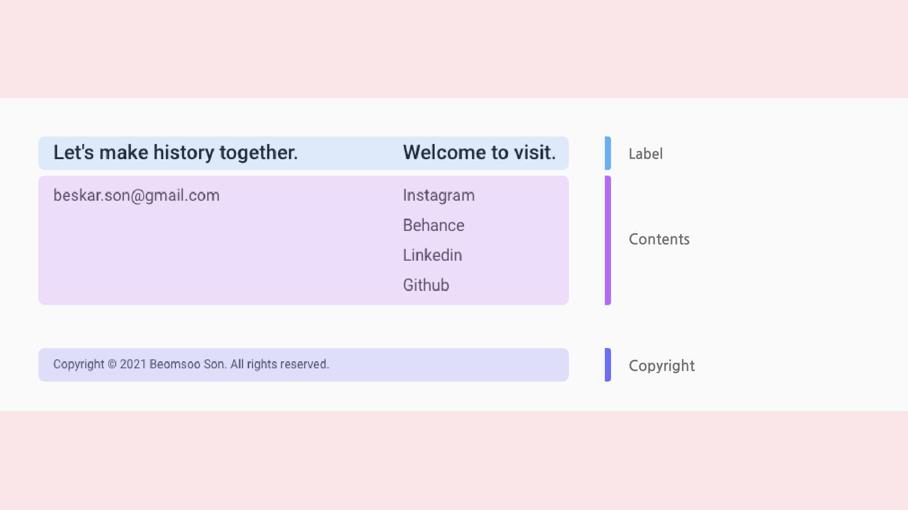
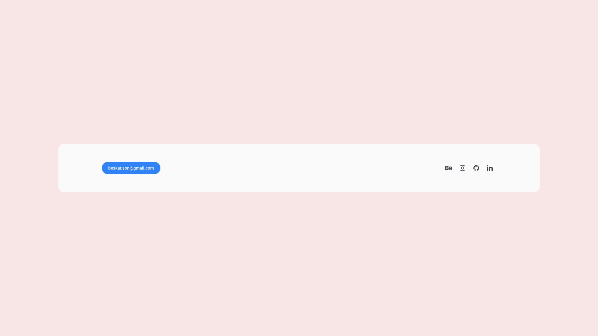
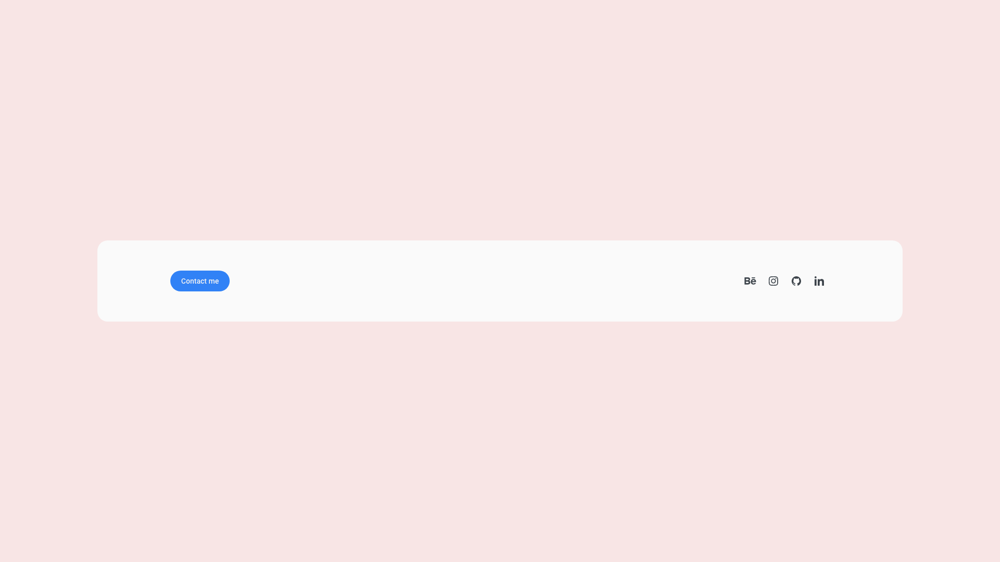
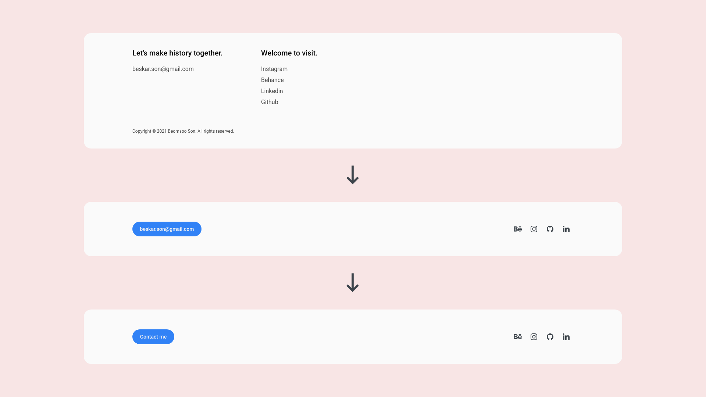

웹서비스에서 푸터는 특정 행동(문의, 타 페이지로 이동 등)을 유도하거나, 서비스 이탈률을 낮출 수 있는 효과적인 컴포넌트 중 하나입니다. 하지만 사용성을 고려하지 않은 푸터는 쓸 데 없는 링크가 모인 그저 그런 공간이 될 수 있습니다. 이번에는 개인 포트폴리오, 블로그 서비스의 푸터 컴포넌트를 개선하면서 고민한 내용을 나누어보려고 합니다.

## AS IS

기존에는 푸터 컴포넌트를 Label, Contents, Copyright. 3개의 영역으로 나누었습니다. Label로 사용자의 관심을 끈 다음 아래 있는 Contents 영역에서 클릭으로 유도하기 위함이었죠. 그런데 예상했던 만큼의 사용자 유입이 일어나지 않았습니다. 전체 사용자 중 아래 SNS 링크의 유입은 5~6% 내외였고, 이메일 주소는 평균 3% 정도였습니다.

## 첫 번째 솔루션

먼저 Label과 Copyright 영역이 사용자의 집중을 방해한다는 가설을 세웠습니다. 각종 링크 역시 Label과 같은 텍스트로 되어있어 사용자를 헷갈리게 만드는 것 같았습니다.

그래서 불필요한 정보라 판단한 Label, Copyright 영역을 과감히 제거했습니다. SNS 링크는 아이콘으로 변경하고, 이메일 주소는 CTA 버튼으로 강조했습니다.

## 결과

가장 궁금했던 건 푸터를 개선한 이후 SNS 방문자 수가 얼마나 증가했는가입니다. 비핸스와 인스타그램 방문자 수는 전달 대비 약 24% 정도 상승했고, 링크드인 역시 조회한 사람 수가 18% 정도 증가했습니다.

## Iteration

그런데 문제가 하나 있었습니다. SNS에 비해 이메일 전환율이 크게 개선되지 않았다는 점입니다. 분명 푸터에서 가장 강조되는 부분이었는데 의도대로 버튼이 작동하지 않았습니다.

2가지 가설을 생각했습니다. 첫 번째는 버튼의 텍스트를 수정하는 것. 두 번째는 mailto의 사용성이 문제라 판단. 메일 보내기 과정을 개선하는 것이었습니다. 먼저 빠르게 적용 가능한 첫 번째 가설부터 실험했습니다.

기존 버튼을 살펴보면 beskar.son@gmail.com을 텍스트 필드로 사용하고 있습니다. 하지만 사용자에겐 클릭 가능한 ‘버튼’인지 이메일 주소를 강조한 것인지 헷갈리기 때문에 Contact me로 버튼의 목적을 명확히 했습니다.

## 두 번째 솔루션

## 결론

안타깝게도 큰 변화는 없었습니다. 이어서 메일 보내기의 사용성을 개선하려고 했지만. 여러 고심 끝에 먼저 양질의 콘텐츠를 많이 만드는 게 더 중요하다는 판단을 했습니다. 좋은 글이 아니라면 아무리 사용성이 뛰어나도 버튼을 클릭조차 하지 않을 테니까요. 원하는 결과를 전부 얻지 못했지만 이번 프로젝트 덕분에 데이터를 분석하고 논리적인 디자인을 해볼 수 있었습니다.
