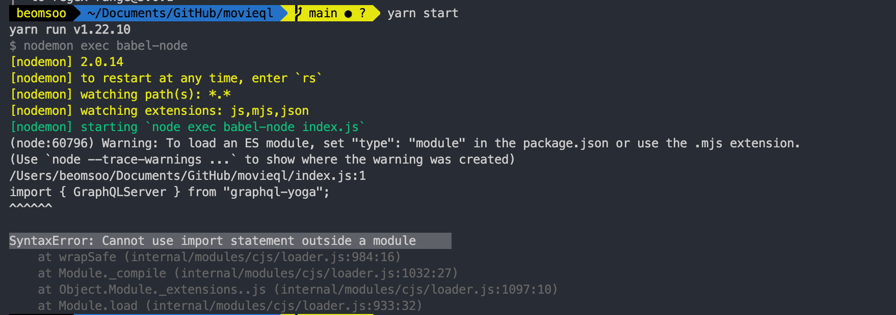
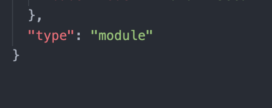

## 원인

package.json의 “type” 필드에 별도의 값이 없거나 “commonjs”로 설정되어 있을 때 발생합니다.

자바스크립트에서의 기본 모듈 처리 방식은 'require'입니다. 하지만 es6 문법인 import를 사용하기 위해서 babel을 설치했습니다. 이때, package에서 변경된 방식을 알려주지 않으면 에러가 발생하게 됩니다.

## 해결법

es6 문법을 사용하기 위해서는 type을 module로 바꿔줘야 합니다.

package.json 파일에 `"type": "module"` 추가하면 해결됩니다.

