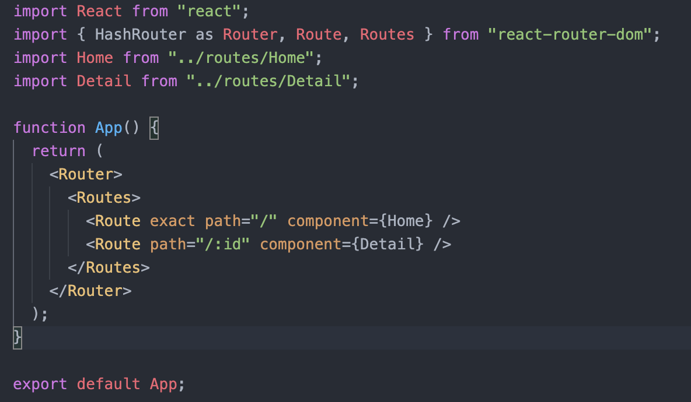
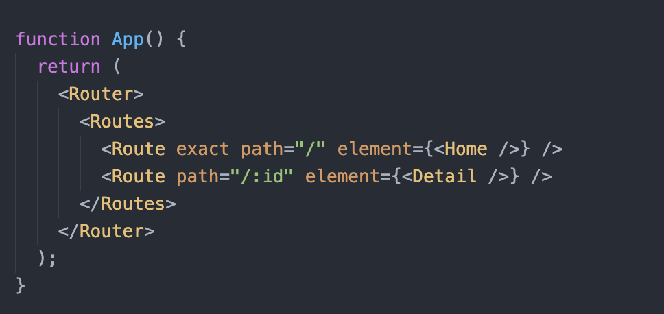

react-router-dom에서 component={Component} 타입으로 Route를 작성했을 때 생기는 에러입니다.

최신 문법으로 변경하면 에러가 해결됩니다.

를

이렇게 바꾸면 됩니다.

[ReactJS routing says page has no element](https://www.reddit.com/r/reactjs/comments/qq253h/reactjs_routing_says_page_has_no_element/)
